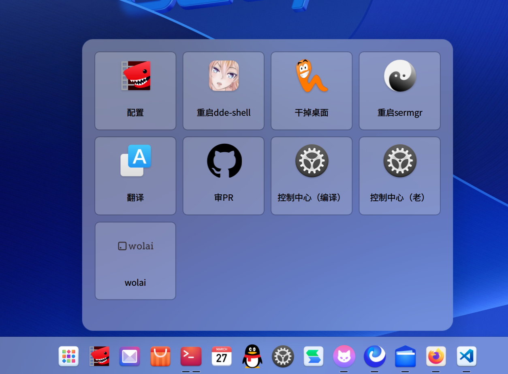

## 配置路径
```
~/.config/devtools.json
```

## 配置示例

- title: 标题
- icon: 图标
- cmd: 点击后要执行的命令

```json
[
    {
        "title": "干掉桌面",
        "icon": "com.apps.Nibbles",
        "cmd": " systemctl --user stop dde-shell-plugin@org.deepin.ds.desktop.service"
    }
]
```
> "配置"按钮可快速打开vscode进行配置

